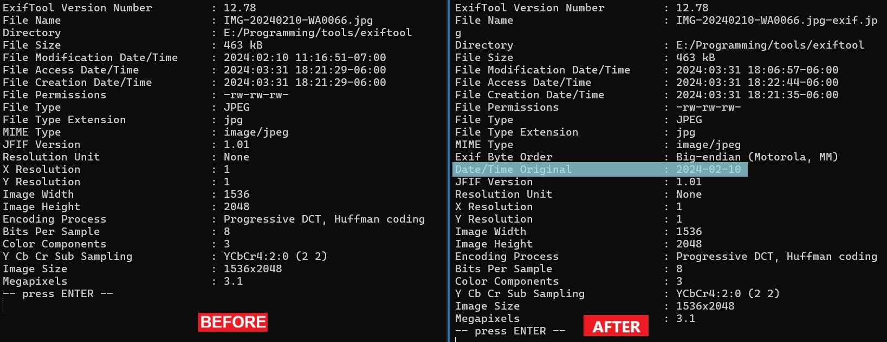

Whatsapp date parsing from file names
---

Issue: When downloading files from Whatsapp application and saving them to a local storage,\
there are no `exif` data saved within the file.

Solution: Whatsapp photos are stored with sent date names. \
This data can be parsed and saved in a new `exif` data.\

This is a simple script to get Whatsapp name,
parse and save to new file with the new `exif` data.

Screenshot
---


Usage
---
- Make sure Python install in your system with app dependencies installed.
- Run command prompt and use CLI command.

### Available options
| Argument       | Description                                         |
|----------------|-----------------------------------------------------|
| `--input_path` | Whatsapp images or videos folder to scanned         |
| `--ouput_path` | The output path to save the resulted media          |
| `--overwrite`  | Of overwrite the existing images in the output path |

Usage:

```
main.py [-h] --input_path INPUT_PATH --output_path OUTPUT_PATH [--overwrite]

the following arguments are required: --input_path, --output_path
```