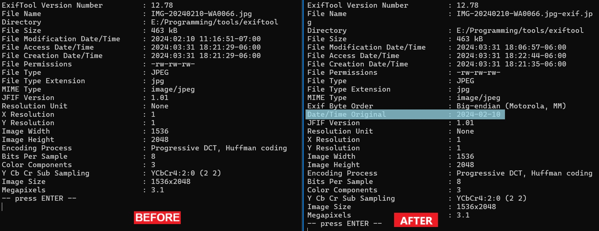

# Whatsapp Date Parsing from File Names

## Problem
When downloading files from WhatsApp and saving them to local storage, the files lack EXIF data.

## Solution
WhatsApp photos are stored with sent date information in their filenames. This script parses that data and saves it as new EXIF data in the image files.


## Features
- Parses WhatsApp filename date information
- Supports phone filenames such as `IMG-20260831-WA0005.jpg` and WhatsApp Web filenames such as `WhatsApp Image 2026-08-31 at 15.41.14.jpeg`, including duplicate suffixes like ` (1)`.
- Uses the explicit filename time when available. For date-only filenames, uses the file modification time when its calendar date matches; otherwise uses midnight. Invalid dates and unrecognized filenames are skipped.
- Saves parsed date as EXIF data in image files
- Supports both images and videos
- Offers recursive folder scanning
- Provides overwrite option for existing files

Screenshot
---


## Prerequisites
- Python 3.x installed on your system
- Required Python dependencies (list them here or include a `requirements.txt` file)

### Arguments

| Argument       | Required | Description                                           |
|----------------|----------|-------------------------------------------------------|
| `--input_path` | Yes      | Path to the folder containing WhatsApp media files    |
| `--output_path`| Yes      | Path to save the processed media files                |
| `--overwrite`  | No       | Overwrite existing files in the output path if present|
| `--recursive`  | No       | Scan input folder recursively for media files         |

Basic syntax:
```commandline
python main.py --input_path INPUT_PATH --output_path OUTPUT_PATH [OPTIONS]
```
### Examples
Basic usage:
```commandline
python main.py --input_path /path/to/whatsapp/folder --output_path /path/to/output/folder
```

With overwrite and recursive options:
```commandline
python main.py --input_path /path/to/whatsapp/folder --output_path /path/to/output/folder --overwrite --recursive
```

## Notes
- Ensure you have necessary permissions to read from the input path and write to the output path.
- The script will maintain the original file structure when using the recursive option.
- Existing EXIF data in the files will be preserved, with the parsed date information added or updated.

## Contributing
Contributions are welcome! Please feel free to submit a Pull Request.

## License
[MIT](https://choosealicense.com/licenses/mit/)


